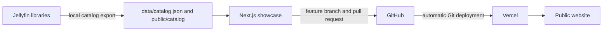

# Public Jellyfin Catalog Showcase

This project publishes a searchable snapshot of selected Jellyfin libraries without exposing Jellyfin itself. Visitors can browse titles, posters, metadata, and membership information without receiving Jellyfin credentials or playback access.

ChatGPT is not required to run, update, deploy, or replicate the finished project.

## How it works

The public site uses a sanitized snapshot. It never contacts Jellyfin at runtime.

## Start here

- [First-time setup](First-Time-Setup) — replicate the project with any Jellyfin library.
- [Catalog operations](Catalog-Operations) — refresh or change the public library without ChatGPT.
- [Architecture](Architecture) — understand the components and privacy boundary.
- [Vercel and releases](Vercel-and-Releases) — previews, production deployments, domains, and rollback.
- [Security and privacy](Security-and-Privacy) — what is and is not published.
- [Troubleshooting](Troubleshooting) — common Windows, GitHub, Jellyfin, and Vercel problems.

## Normal operating workflow

1. Change the media or library access in Jellyfin.
2. Run `npm run catalog:update` from a clean local clone.
3. Review the draft catalog pull request created by the updater.
4. Merge it into `main`.
5. Vercel automatically deploys the new catalog.

This workflow works whether or not ChatGPT is available.
